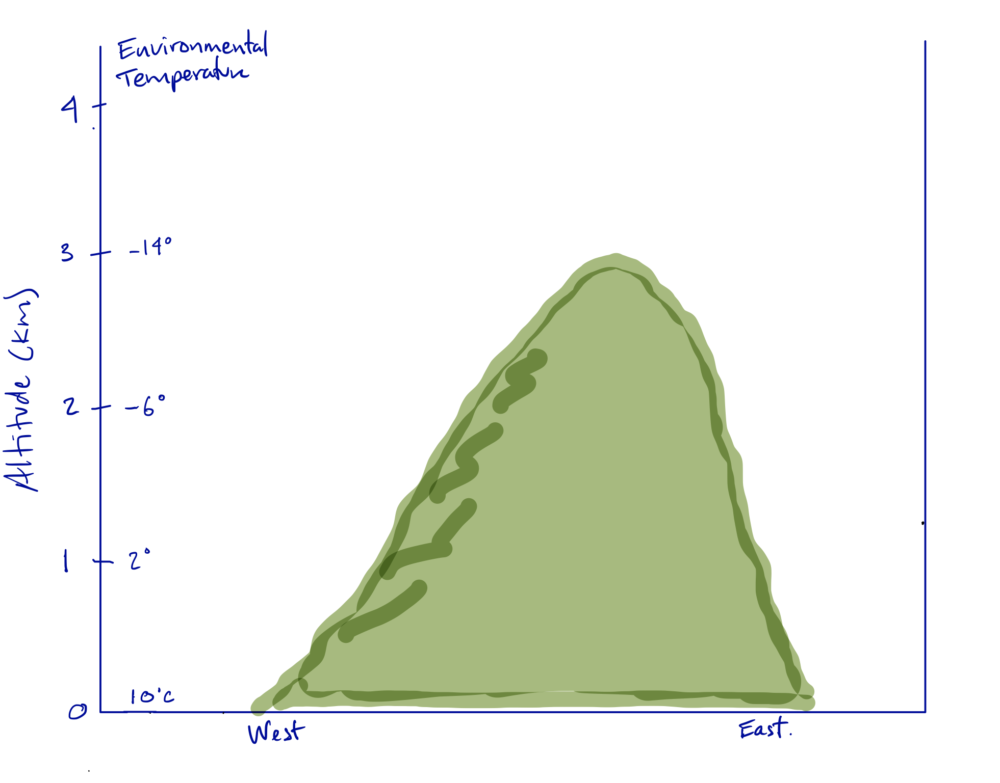
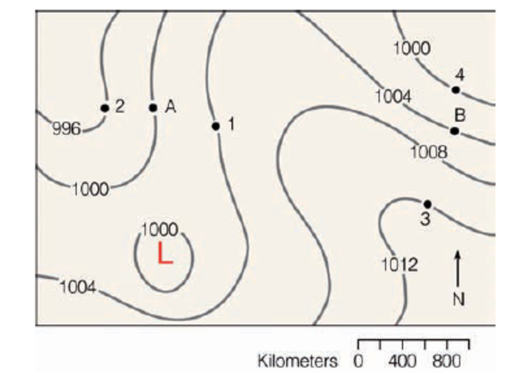

# 2) Atmospheric Structure and Thermodynamics

**Recommended Reading**
For this week, we recommend reading Ch 2 and Ch 3 in Shuttleworth's [Terrestrial Hydrometerology](https://bcs.wiley.com/he-bcs/Books?action=index&bcsId=6961&itemId=0470659378).

```note
## Lab 2: Plotting balloon soundings

Download the lab and data files to your computer. Then, upload them to your JupyterHub [following the instructions here](/resources/b-learning-jupyter.html#working-with-files-on-our-jupyterhub).

* Data: [Practice Data](data/my_data.csv)
* Data: [Sounding Data Dec 26](data/2021-12-26_radiosonde.csv)
* Data: [Sounding Data Jan 03](data/2022-01-03_radiosonde.csv)
* Data: [Sounding Data Jan 06](data/2022-01-06_radiosonde.csv)
* Data: [Sounding Data Jan 10](data/2022-01-10_radiosonde.csv)
* Graphic: [Ceilometer backscatter plot](data/ceilometer_backscatter.png)
* [Lab 2-1: Practice Coding in a Jupyter Notebook](lab2/lab2-1.ipynb) 
* [Lab 2-2: Graphical Data Analysis - Practice Plotting Data](lab2/lab2-2.ipynb)
* [Lab 2-3: Atmospheric Thermodynamics - Practice Plotting Sounding Data](lab2/lab2-3.ipynb)

```


## Homework 2

### Problem 1

On a cold snowy morning the air temperature and dew point of the outside air are both -10&deg;C. If this air is brought indoors and warmed to 20&deg;C with no change in the vapor content, what is the relative humidity of the air inside the home?

(Note:   You may solve this using a Jupyter notebook following examples in the lab, or you may use a pen/pencil and paper.)

### Problem 2

Three cities have the following temperature (T) and dew point (Td) during a March afternoon:

| city | temperature | dew point temperature |
| --- | --- |  --- |
| San Diego, CA | T = 20&deg;C | Td = 14&deg;C |
| Spokane, WA | T = 14&deg;C | Td = -2&deg;C |
| Denver, CO | T= 24&deg;C | Td= -10&deg;C |

Which city has
* (a) the highest relative humidity?
* (b) the lowest relative humidity?
* (c) the most water vapor?
* (d) the least water vapor?

(Note:  You may solve this using a Jupyter notebook following examples in the lab, or you may use a pen/pencil and paper.)


### Problem 3 (option 1: choose this if you dislike python)
The figure below shows environmental temperature data on the west side of a conical mountain.  Suppose the wind is blowing from the west and a parcel of surface air with a temperature of 10&deg;C and a dew point of 2&deg;C begins to rise upward along the western (windward) side of the hill.



* (a) Calculate the environmental lapse rate
* (b) What type of atmospheric stability does the sounding indicate?
* (c) What is the relative humidity of the air parcel at 0 m before rising?
* (d) As the air parcel rises, at approximately what elevation would condensation begin and a cloud start to form?
* (e) What is the air temperature and dew point of the rising air at the base of the cloud?
* (f) What is the air temperature and dew point of the rising air inside the cloud at an elevation of 3000m?
* (g) At an altitude of 3000m, how does the air temperature inside the cloud compare with the temperature outside the cloud? What type of atmospheric stability does this suggest?

### Problem 3 (option 2: choose this if you want to use python)
Using the jupyterhub, and building off what we learned in lab 2-3, look at the environmental temperature and relative humidity data from the sounding launched in Gothic, Colorado on January 6, 2022. 

* (a) Calculate the environmental lapse rate
* (b) Assuming the lowest level of the sounding represents the surface temperature and relative humidity, plot the temperature a dry air parcel would have if it were lifted adibatically from that point
* (c) What is the dew point temperature of the parcel at the surface?
* (d) Assuming that the dew point temperature decreases with elevationn at a rate of 2 K/km (2&deg;C/km), at what elevation would estimate that a cloud would form?  (Hint:  Plot this line on your graph from Td at the surface with the dry adiabat plotted from T at the surface.)
* (e) How does this height compare with the base height where a cloud seems to exist in this sounding?
* (f) How do both of these compare with the base height as estimated from the plot from the ceilometer in the lab?
* (g) At a height of 5000 m, how does the air temperature estimated from your rising parcel of air compare to the observed air temperature?  What type of atmospheric stability does this suggest?

### Problem 4
The sea-level chart (below) is drawn for flows in the Northern Hemisphere.




* What are the magnitudes and directions (sketch this) of the geostrophic velocities at points A and B?

* Will the actual velocity magnitudes be larger or smaller than these estimates? Why?


### Problem 5: Final Presentation Topic Selection

Look at the list of topics [here](https://mountain-hydrology-research-group.github.io/Fluid_Flows/overview/b-project.html).  Write a ranked list (from 1st choice to 10th choice) of your preference for topics.  If you only have strong preferences for 5, it's okay to rank from 1st to 5th (but please include at least 5).  **If you have questions about the project or the topics, please talk to the instructor.**
