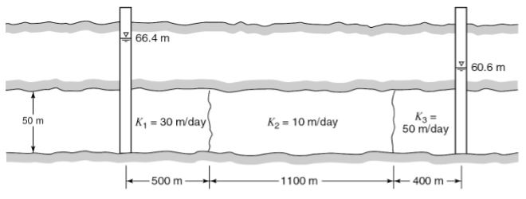
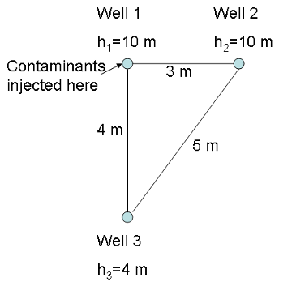

# 6) Groundwater Flow


```note
## Lab 6: Contaminants in Groundwater

* Lab 6-1:  Download the [Contaminants Worksheet](lab6/Contaminants_labworksheet.pdf)  We will also have printed copies available in the lab.  You will want to hand-draw sketches of contaminant transport.  The [Lab 6-2](lab6/lab6-2.ipynb) python notebook will help you answer question 5 on the worksheet.

* [Lab 6-2: Modeling Groundwater Contaminants](lab6/lab6-2.ipynb)

```


## Homework 6: 

### Problem 1: (3 points) Water Flow through confined aquifers

Water flows through three confined aquifers in series with the properties shown below.  Two observation wells indicate piezometric heads on either end of 66.4 m and 60.6 m.  Determine the flow rate per unit width of the aquifer and the head losses in each component of the aquifers between the observation wells.

 

### Problem 2: (3 points) Water Flow through unconfined aquifers

An unconfined aquifer has a hydraulic conductivity of 6 x 10^{-2} cm/s.  There are two observation wells 600 ft apart.  Both penetrate the aquifer to the bottom.  In one observation well the water stands 29 ft above the bottom, and in the other it is 26 ft above the bottom. (a) What is the discharge per 100-ft-wide strip of the aquifer in cubic feet per day? (b) What is the water table elevation at a point midway between the two observation wells?

### Problem 3: (3 points) Contaminant Transport and breakthrough curves

Note: The lab activities will help you with this problem.   You have three observation wells, as shown below.  Three contaminants, A, B, and C are released into the aquifer at Well 1 at a constant, steady rate.  You are monitoring for each of these contaminants at Well 2 and Well 3.  You know the following about the contaminants: All three contaminants are subject to advection.  Contaminant A does not disperse or adsorb.  Contaminant B has a very high dispersion coefficient but does not adsorb.  Contaminant C is subject to slight dispersion (higher than A but less than C) and has a strong tendency to adsorb to soil particles. 

 

**(a)** Sketch the break-through curves (x-axis, time after introcution of contaminant t, vs. y-axis, relative contaminatn concentration C/C0) for each contaminant for Well 2.  Explain your reasoning.

**(b)** Sketch the break-through curves (x-axis, time after introcution of contaminant t, vs. y-axis, relative contaminatn concentration C/C0) for each contaminant for Well 3.  Explain your reasoning.

**(c)** What additional information do you need to know to be able to predict whether Well 2 or Well 3 will be the first to detect a contaminant?  Why?

### Problem 4: (1 point) Project Feedback

In either canvas or slack, you will be assigned two project proposals to review.
Here are the questions to address in the review:

**(a)**  Is the amount of subject material about right for a 3-5 minute video?  Or too long or short?  How would you recommend adjusting the amount of content?

**(b)** Are the ideas interesting and appropriate for the target audience (this class)?  What potential enhancements or changes would you recommend?

**(c)** Does the practical plan for recording the video make sense?  Any suggestions on how to improve the technical part of the process, given the ideas presented? 

**(d)** What do you like best about the ideas presented?

**(e)** What do you think could be improved?

