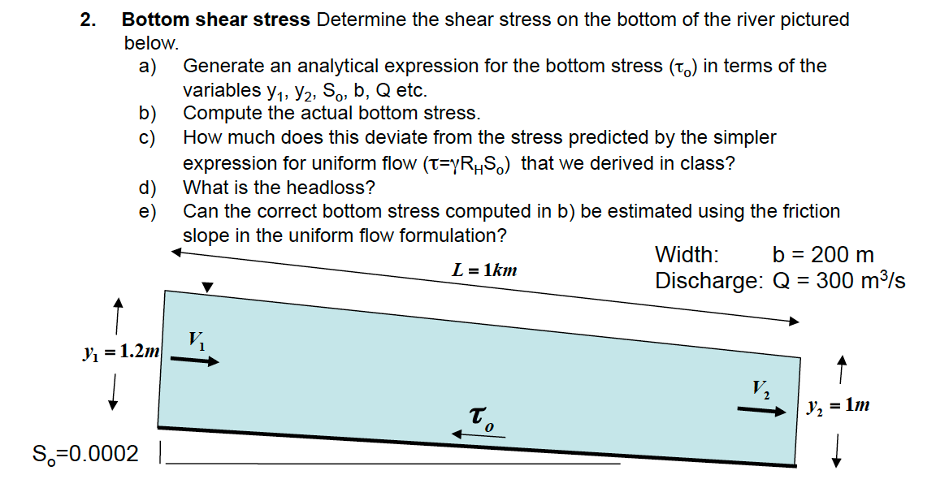

# 7) Streams, rivers, and channels

```note
## Lab 7: Rating curves & Mixing and Dispersion in Rivers

Download the lab and data files to your computer. First you will need the lab worksheet [Mixing and Dilution Worksheet](lab7/CEE348_Spring_2022_Week9Lab.pdf)  This is will be part of Homework 8, but we want to start early.

* [Lab 7-1: Rating Curves](lab7/lab7-1.ipynb)
  * data: [Lyell_h_Q_sorted.mat](data/Lyell_h_Q_sorted.mat)
  * image: [LyellForkTuolumnegagesite](lab7/LyellFork_Tuolumne_flowcontrol.png)
* [Lab 7-2: Mixing and Dispersion in Rivers](lab7/lab7-2.ipynb)
  * data: [CEE348_dye_data_Lab7.xlsx](data/CEE348_dye_data_Lab7.xlsx)

```
## Lab Problem:  To be solved together in workshop

Hints:  For 1a, use the full conservation of momentum expression derived in class, before we simplified using uniform flow.  Remember that the friction slope, Sf = hL/L  (head loss divided by the length).  For 1b, use the expression you generated in 1a.
          
2.  Friction slope
* a) Using the values from Problem 1, above, justify why it is common practice to use the water surface slope (Ssurface) as an approximation for the friction slope ($S_f$).  (Hint:  Use your equation from above with both values plugged in and see how different they are.)

* b) What is the percent difference between the actual friction slope and the water surface slope?

* c) When would you expect the difference between $S_{surface}$ and $S_f$ to be large?

## Homework 7:

### Problem 1:  Submit your write-up of the lab/workshop problem above
 
### Problem 2: The Fischer River

The Fischer River has a channel bed slope of $S=5×10^{-5}$, depth of H=1.5 m, width of 20 m and a bed consisting of 1 cm pebbles, with a Manning’s n of 0.03.  A contaminant is introduced at the bottom of the river in the center of the channel. In this problem, assume that the flow is uniform. Determine:
* The shear velocity, u_*
* The depth averaged velocity U using the Manning equation.
* The distance downstream where the contaminant concentration can be assumed to be well-mixed in the vertical. As in the class example, assume well-mixed conditions occur when h=2.5σ, where σ is the standard deviation of the concentration distribution.  Use the u_*  and U values from a and b.
* The distance downstream where the contaminant concentration can be assumed to be well-mixed across the channel.  Remember that it starts in the middle of the channel, so this is the distance traveled downstream during the time it takes to reach one edge.  Use the higher value of the transverse turbulent diffusion coefficient from the notes, as this is more accurate for natural streams.

### Probelm 3: River bed erosion
 
To avoid erosion, the river bed is armored with large cobbles, increasing the bed resistance. In a 1km section of the river the depth decreases from 1.9 m to 1.5 m. For this calculation you are told that the discharge is $44 m^3/s$.  The channel bed slope and width can be considered to be the same as in the prior problem.  Determine:

* The head loss and friction slope
* The shear velocity, u_*


