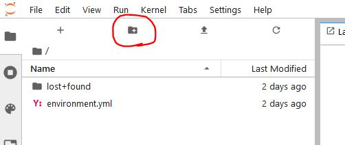
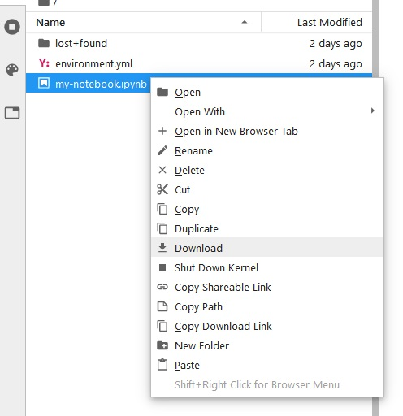

# Jupyter

## Jupyter Notebooks
 
"A Jupyter notebook is a document that supports mixing executable code, equations, visualizations, and narrative text. Specifically, Jupyter notebooks allow the user to bring together data, code, and prose, to tell an interactive, computational story. Whether analyzing a corpus of American Literature, creating music and art, or illustrating the engineering concepts behind Digital Signal Processing, the notebooks can combine explanations traditionally found in textbooks with the interactivity of an application." (From [Teaching and Learning with Jupyter](https://jupyter4edu.github.io/jupyter-edu-book/why-we-use-jupyter-notebooks.html#but-first-what-is-jupyter-notebook))

* Video: [What are Jupyter Notebooks?](https://www.youtube.com/watch?v=eJDxcR1V7Qg)
* [Jupyter Notebook Keyboard Shortcuts](https://cheatography.com/weidadeyue/cheat-sheets/jupyter-notebook/pdf_bw/)
* For more information, see the [Jupyter documentation](https://jupyter.readthedocs.io/en/latest/).

## JupyterHub

A JupyterHub is a collection of single-user Jupyter notebook servers, which are accessable remotely via a web browser. When you sign in to our JupyterHub, you're given your own computing environment within which you can create and run Jupyter notebooks, store a moderate amount of files and data, and use a terminal.

While it is possible to [run Jupyter Notebooks locally on your own computer](#), we suggest that you use the JupyterHub for labs, homeworks, and projects in this class.

[Our JupyterHub](https://rttl.axdd.s.uw.edu/2021-autumn-cee-465-a) is managed by the university IT department, and you can access it with your NetID username and password.

### Getting started on our JupyterHub

1. Open a web browser and go to this URL: [https://rttl.axdd.s.uw.edu/2021-autumn-cee-465-a/](https://rttl.axdd.s.uw.edu/2021-autumn-cee-465-a) (bookmark the page for easier access).

2. Click on *Sign in with University of Washingotn NetID*, enter your username and password:


3. If prompted with "Jupyter RTTL Pilot" message from Canvas, click *Authorize*


4. You should see a message "Your server is starting up." and below it a status bar as your personal server starts. 


```note
**If you encounter an error here or your server fails to start**, copy or screenshot the text of the "Event log" or any other error messages that appear and email the course instructor or TA.
```

5. You should now see the JupyterHub interface in your web browser. You're now ready to use Jupyter notebooks!


### Working with files on our JupyterHub

* To upload lab notebooks or data files, click on the "Upload Files" icon in the upper left menu, navigate to the files you want in the File Upload window, then click "Open"


```note
**GitHub Option:**

While we won't be covering how to use GitHub in this course, if you are already familiar with using git, or [would like to learn how to use it on your own](https://swcarpentry.github.io/git-novice/), you are welcome to use it. I will try my best to address any issues or questions you have about using GitHub in this class.

First, create your own GitHub respository for your labs and homework assignments. Download lab and data files from this website and upload to your JupyterHub. You can then use the terminal in JupyterHub to can add, commit, and push them to your repository as you work on labs and homeworks.

```

* You can organize files into folders, click the "New Folder" icon in the upper left menu to create a new folder.


* To create a new Jupyter Notebook file, click on the "Python 3" icon under the "Notebook" section of a Launcher tab. (To open a new Launcher tab, got to *File* > *New Launcher*)
 
 
* To save a Jupyter Notebook file you're working in, click the Save icon on the top left of the Notebook window, or go to *File* > *Save Notebook*

* Download files to your computer by right-clicking on the file in the navigation pane, then click on Download.



```note
Logging out of the JupyterHub will **NOT** cause any of your work to be lost or deleted, it simply shuts down some of the computing resources (like shutting off your laptop at the end of the day)
```


## Additional References and Resources
- ["Jupyter and JupyterHub"](https://waterhackweek.github.io/learning-resources/prep/jupyterhub/) from [Waterhackweek 2020](https://waterhackweek.github.io/)
- "Jupyter and Scientific Python basics: numpy, pandas, matplotlib" from *[OceanHackWeek 2020](https://oceanhackweek.github.io/)*: [Jupyter notebooks](https://github.com/oceanhackweek/ohw-preweek/tree/master/data-analysis-modules) — [tutorial video](https://youtu.be/CTUAgpvfze0).
- From [https://dataquest.io](https://dataquest.io)
    - [Jupyter Notebook for Beginners: A Tutorial](https://www.dataquest.io/blog/jupyter-notebook-tutorial/)
    - [Tutorial: Advanced Jupyter Notebooks](https://www.dataquest.io/blog/advanced-jupyter-notebooks-tutorial/)
    - [28 Jupyter Notebook Tips, Tricks, and Shortcuts](https://www.dataquest.io/blog/jupyter-notebook-tips-tricks-shortcuts/)
